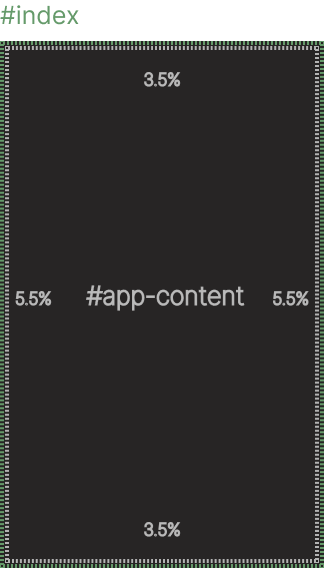

# CloudKit

## Free lightweight library for svelte/kit projects! (75.3 kB) 
*Created and used by [CloudScript](https://www.cloudscript.live/en/). Currently **under development!***

## **Disclaimer** ⚠️
`This package is not meant for production for now`. Many things are still missing and the docs still are not done. Anyways, it's fairly stable.

<br />

## **What is included?** 🧐

#### `Svelte components`
* Context-menu
* Data-table
  * Horizontal
* Input-field
* Input-password
* Button
* Checkbox
* Dropdown

#### `Typescript`
* **Utilities**
  * **array functions**
    * objectsToRaw
    * concatClasses
  * **async functions**
    * pause
  * **myScreen**
    * isMobile 
    * isTablet
    * isDesktop
  * **random**
    * randomInteger
    * randomString
  * **string**
    * capitalize
  * **time**
    * currentTime
* **Constants**
  * **screen**
    * mobile
    * desktop

#### `SCSS eco-system`
* Auto page [?](#auto-page)
* Global themes (every element inherits corresponding theme)
* Global font responsiveness
* Reusable classes (like bootsrap)
* Fully customizable

<br />

## **Reusable Components**
The built-in scss already give responsiveness and custom stylings to html elements, but they get ehanced even more! CloudKit components are just basic html elements wrapped with special features or stylings. These components are highly configurable and are alle type-safe due to typescript.

[Examples](#usage-of-some-components)

<br />

## **Eco-System & SCSS**

### What are we talking about?
CloudKit has a so called 'eco-system', where everything works together with the purpose of giving the best user experience. Everything can be customized by you! You can give custom preferences like the color-theme, or which reusable class should be compiled or not. CloudKit has already a default configuration which you can use of course.

### Docs
All classes and mixins are documented in detail at the following [page (todo)](#link)

### How to include the global styles
With svelte-kit, a good idea would to include it in your root __layout.svelte. This way every page/component will inherit the stylings. With normal svelte it works the same, put it in your root entry-point. Important is that it can process scss.

*Make shure to add the **global** flag. Otherwise the stylings will be scoped in that file.*

```html
// __layout.svelte
<style lang="scss" global>
    @use 'svelte-cloudkit/scss/global' as *; // No namespace is needed
</style>
```

### How to configure the eco-system
As mentioned before, you could use CloudKit without any further configurations, but of course everybody has different needs.

After you imported all global stylings, you can override them using the `with` key.
  
  *@forward would work too but it's not recommended, since it has a different purpose*

```html
// __layout.svelte
<style lang="scss" global>
  @use 'svelte-cloudkit/scss/conf' as CONFIG with ( // Namespace is recommended to avoid conflicts
      $boxed: 9% 9% // This would override the variable var(--boxed)
  );

  @use 'svelte-cloudkit/scss/global' as *; // Always include after the configurations! 
</style>
```
Pretty easy, right? A full documentation of all possibile configurations can be found [here (todo)](#lol)

<br />

## **Usage of some components**
*Note. that I wont document every component here. All components already use jsdoc and are pretty self explaining. Anyways, in the future I will do a full documentation + examples.*

For the first example let's use a simple one, the `<button>`.
```typescript
<script lang="ts">
    // Import the button component
	import Button from 'svelte-cloudkit/components/user/button.svelte';

	// Define onClick function
	function onClick() {
    	alert("Clicked!");
	}
</script>

<Button uppercase size="lg" func={onClick}>click me</Button>
```

Now let's try the `context-menu`:
```typescript
<script lang="ts">
	// Import the ContextMenu component
	import ContextMenu from 'svelte-cloudkit/components/user/ContextMenu.svelte';
 
	// For the image an absolute path is needed (any img format).
	const contextMenuConfig: CloudKit.ContextMenu.config = {
		items: [
			{ value: 'rename', img: '{image_path}' },
			{ value: 'alert', img: '{image_path}', func: () => alert(1) },
			{ value: 'close', img: '{image_path}' }
		]
	};
</script>

/*  
It is recomanded to put the component in the same file where you need it, but it isn't necessary since it attaches to an element by selector.
*/

<TableContextMenu
	items={contextMenuConfig.items}
	targetsSelector="#target"
/>

<div id="target" style="width: 200px; height: 200px">
    Hi
</div>
```

<br />

## **Auto page**
By using this structure, you can take advantage of paddings and fixed sizes. Everything inside #app-content will be inside the padding `var(--fluid)` (default: `padding: 3.5% 5.5%`) and everything inside the #index div won't be affected by anything (full width).

This is how you could use it:
```html
<html>
	<body>
		<div id="index">
            <Header />
            <div id="app-content">
                <h1>Welcome!</h1>
            </div>
			<Footer />
        </div>
	</body>
</html>
```
In this case the index page is 100vh and the app-content has a padding that as default is **3.5% 5.5%**

#### Styles
```scss
body {
    // ...body styles
    #index {
	    height: 100vh;

	    #app-content {
		    @extend .fluid-content; // padding: 3.5% 5.5% !default
		    @extend .h-100; // height: 100%
	    	@extend .overflow-h; // Hide overflow
        }
    }
}

```
#### This is a graphical representation.


<br />

### Not using auto page
In this case, the only body will receive some helpful styles:
```scss
body {
	background-color: var(--background);
	margin: 0;
	max-width: 100vw;
	min-height: 100vh;
	@extend .overflow-x; /* Hide horizontal overflow */


	&,
	*,
	*::after,
	*::before {
		-webkit-box-sizing: border-box !important;
		-moz-box-sizing: border-box !important;
		-ms-box-sizing: border-box !important;
		box-sizing: border-box !important;
	}
}
```

<br />

## Theme & Font
There exist 4 component themes.
### Types
```typescript
declare namespace Theme {
	type Colors = 'dark' | 'primary' | 'light' | 'special';
    ...
}
```
### Default colors
Most of the colors are from boostrap but there are some extras. These color **have to be defined** when overwritten, because all components inherit at least one of these colors.

-  `#202123 background`
-  `#0d6efd blue`
-  `#ffffff30 borders`
-  `#6f42c1 purple`
-  `#d1a8ff purple-light`
-  `#d63384 pink`
-  `#dc3545 red`
-  `#fd7e14 orange`
-  `#daff0f yellow`
-  `#198754 green`
-  `#20c997 teal`
-  `#d1d1d1 text`
-  `#8e8e8e text-gray`
-  `#0dcaf0 cyan`
-  `#fff white`
-  `#6c757d gray`
-  `#343a40 gray-dark`
-  `#2c9060 primary`
-  `#6c757d secondary`
-  `#9747ff special`
-  `#198754 success`
-  `#0dcaf0 info`
-  `#ffc107 warning`
-  `#dc3545 danger`
-  `#f8f9fa light`
-  `#1d1e20 dark`

If one of these colors is missing in the color theme, then you probably will run into components that don't have colors applied.The rest of the [shown colors](#default-colors) are not used by any component.
The necessary colors are the following:
* **background** *applied on the body*
* **borders** *borders of most components*
* **text** *default text color*
* **text-gray** *gray text*
* **primary** *can be a component's background*
* **special** *can be a component's background*
* **success** *used for span*
* **warning** *used for span*
* **danger** *used for span*

### Default font & responsiveness
The default families are:
* **Inter** *all text*
  * fallback: sans-serif 
* **Fira Code** *text with the class mono `<h3 class="mono">...</h3>`*
  * fallback: monospace

For now the h3 and h5 tag are default set to monospace. In the future it will be possible to decide which tag should have specific font styles.

CloudKit makes your text elements responsive, based on their tag and screen size. All text elements such as: `<h1-h5>,<p>,<a>` and so on... These are the hard-coded values for each screen size:

*`<h1>` and `<h2>` get their own size*

```scss
:root {
	// XS
	--fs-h1: 2rem;
	--fs-h2: 1.3rem;
	--fs-lg: 1.1rem;
	--fs-md: 0.9rem;
	--fs-sm: 0.75rem;
	--fs-xs: 0.55rem;

  /*
    $mobile: 37em !default;
    $tablet: 50em !default;
    $pc: 80em !default;
  */

	@include mediaMin($mobile) {
		--fs-h1: 3rem;
		--fs-h2: 2.8rem;
		--fs-lg: 1.4rem;
		--fs-md: 1.13rem;
		--fs-sm: 1rem;
		--fs-xs: 0.67rem;
	}

	@include mediaMin($tablet) {
		--fs-h1: 4rem;
		--fs-h2: 2.8rem;
		--fs-lg: 1.4rem;
		--fs-md: 1.13rem;
		--fs-sm: 1rem;
		--fs-xs: 0.67rem;
	}

	@include mediaMin($pc) {
		--fs-h1: 4rem;
		--fs-h2: 2.8rem;
		--fs-lg: 1.5rem;
		--fs-md: 1.3rem;
		--fs-sm: 1.13rem;
		--fs-xs: 0.8rem;
	}
}
```

*Note. that the screen sizes used here, can be overitten trough configuration as well.*