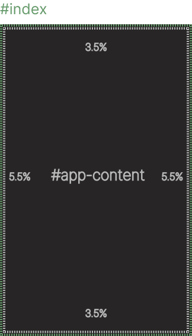

# <p align="center" />CloudKit  
<br />

## Free lightweight library for svelte/kit projects! (60.7 kB) 
*Created and used by [CloudScript](https://www.cloudscript.live/en/). Currently **under development!***

## **Disclaimer**
`This package is not meant for production for now`. Many things are still missing and the docs still are not done. Anyways, it's fairly stable.

<br />

## **What is includes?** 🧐

#### Svelte components
* Context-menu
* Data-table
  * Horizontal
* Input-field
* Input-password
* Button
* Checkbox
* Dropdown

#### SCSS eco-system
* Global themes (every element inherits corresponding theme)
* Global font responsiveness
* Reusable classes (like bootsrap)
* Fully customizable

<br />

## **Reusable Components**
The built-in scss already give responsiveness and custom stylings to html elements, but they get ehanced even more! CloudKit components are just basic html elements wrapped with special features or stylings. These components are highly configurable and are alle type-safe due to typescript.

[Examples](#usage-of-some-components)

<br />

## **Eco-System & SCSS**

### What are we talking about?
CloudKit has a so called 'eco-system', where everything works together with the purpose of giving the best user experience. Everything can be customized by you! You can give custom preferences like the color-theme, or which reusable class should be compiled or not. CloudKit has already a default configuration which you can use of course.

### Docs
All classes and mixins are documented in detail at the following [page (todo)](#link)

### How to configure the eco-system
As mentioned before, you could use CloudKit without any futher configurations, but of course everybody has different needs.

* First you need to import CloudKit's global styles using the `@use` key. Make shure to add the **global** flag. Otherwise the stylings will be scoped in that file.
  
  *@forward would work too but it's not recommended*
    ```html
    // __layout.svelte
    <style lang="scss" global>
        @use 'svelte-cloudkit/scss/global' as *;
    </style>
    ```
* Then using the `with` key you can pass variables/lists.
     ```html
    // __layout.svelte
    <style lang="scss" global>
        @use 'svelte-cloudkit/scss/global' as * with (
            $spacings: (boxed: 6% 6%, fluid: 3% 3%)
        );
    </style>
    ```
Pretty easy, right? A full documentation of all possibile configurations can be found [here (todo)](#lol)

<br />

## **Usage of some components**
*Note that I wont document every component here. All components already use jsdoc and are pretty self explaining. Anyways, in the future I will do a full documentation + examples.*

For the first example let's use a simple one, the `<button>`.
```typescript
<script lang="ts">
    // Import the button component
	import Button from '$lib/svelte/user/button.svelte';
</script>
    // Usage
    function onClick() {
        alert("Clicked!");
    }
	<Button uppercase size="lg" func={onClick}>click me</Button>
```

Now let's try the `context-menu`:
```typescript
<script lang="ts">
// Import the ContextMenu component
import ContextMenu from '$lib/svelte/user/ContextMenu.svelte';

/*  
For now you have to put your images at the path: /static/assets/interact/{image_name}.png
Im sorry for the inconvenience but for now you have to follow this path.
*/

const contextMenuConfig: TContextMenu['config'] = {
	items: [
		{ value: 'rename', img: '{image_name}.png' },
		{ value: 'dublicate', img: '{image_name}.png' },
		{ value: 'close', img: '{image_name}.png'}
	]
};
</script>

/*  
It is recomanded to put the component in the same file where you need it, but it isn't necessary since it atatches to an element by selector.
*/

<TableContextMenu
	items={contextMenuConfig.items}
	targetsSelector="#target"
/>

<div id="target" style="width: 200px; height: 200px">
    Hi
</div>
```
*Further documentation of all features are found at each component (JSDOC).*

<br />

## **Dom structure**
The `default structure` is this:
```html
<html>
	<body>
		<div id="index">
            ...outer contents
            <div id="app-content">
                ...contents
            </div>
        </div>
	</body>
</html>
```
By using this structure, you can take advantage of paddings and fixed sizes. Everything inside #app-content will be inside the padding `var(--fluid)` (default: `padding: 3.5% 5.5%`) and everything inside the #index div won't be affected by anything. You can disable this pattern and use any structure, as long as everything is inside the `<body>`.

*Watch out, if not disabled and if the dom doesn't follow this structure, no stylings will be applied!*

### Using the default structure
#### Styles
```scss
body {
    // ...body styles
    #index {
	    height: 100vh;

	    #app-content {
		    @extend .fluid-content; // padding: 3.5% 5.5% !default
		    @extend .h-100; // height: 100%
	    	@extend .overflow-h; // Hide overflow
        }
    }
}

```
#### This is a represention of the structure.


<br />

### Using no structure
In this case, the body tag will be used as reference.
```css
body {
	background-color: var(--background);
	margin: 0;
	max-width: 100vw;
	min-height: 100vh;
	@extend .overflow-x; /* Hide horizontal overflow */
}
```